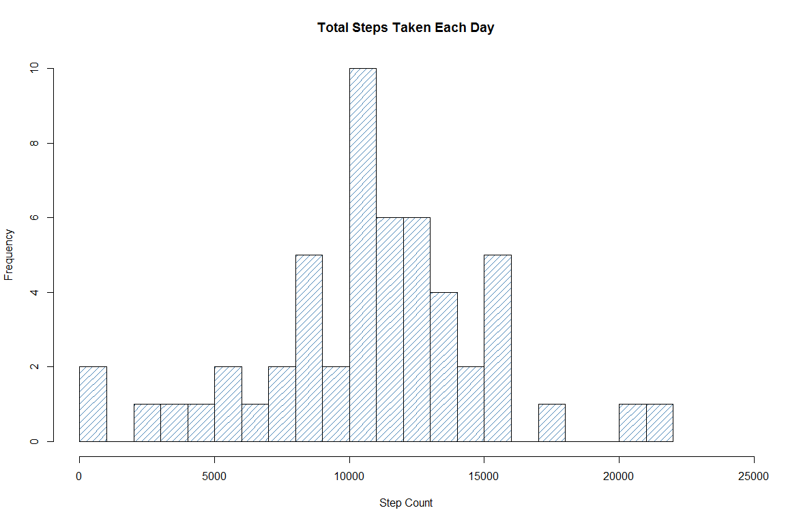
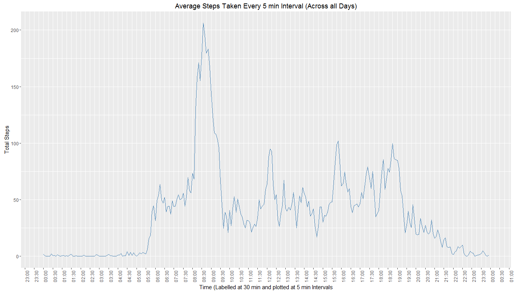
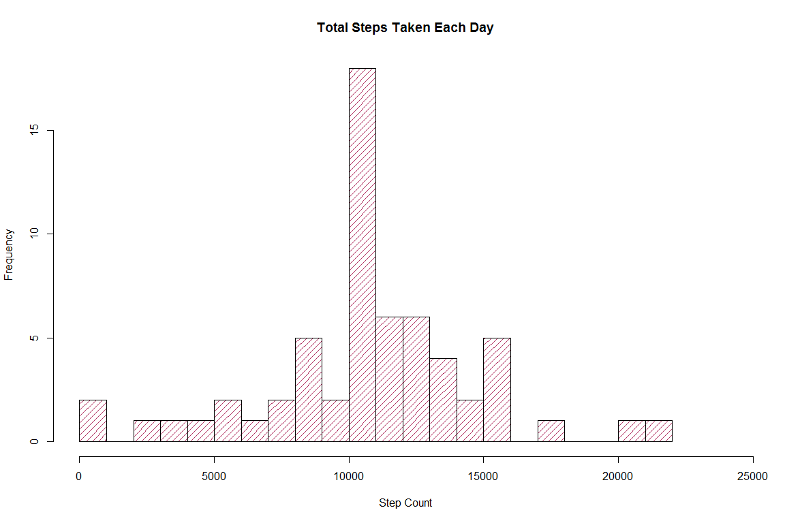
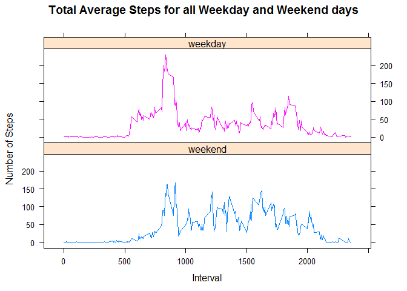

# Week 2 - Peer Graded Assignment - Course Project 1
Paul Loh  
18 January 2017  


## Loading and preprocessing the data

1. Load the activity data into a dataframe called *dfActivity*, and,  
2. set the *stringsAsFactors* argument to FALSE in order to set the *date* variable to a *date* data type.


```r
  dfActivity <- read.csv("activity.csv", header = TRUE, stringsAsFactors = FALSE)
```

## What is mean total number of steps taken per day?  

1. The total number of steps taken each day has been calulated using the *aggregate* function and stored in the data frame *dfStepsPerDay*. Note the aggregate function will ignore missing values by default which is the behaviour wanted:  


```r
  dfStepsPerDay <- aggregate(steps ~ date, dfActivity, sum)
  dfStepsPerDay$date <- as.Date(dfStepsPerDay$date)
```
  
Now total steps per day is stored use the *range* function to get an idea for a suitable interval on the x axis of the histogram:  
    

```r
range(dfStepsPerDay$steps)
```

```
## [1]    41 21194
```
  
  
2. This histogram is plotted using the *hist* function of the *Base* graphics system:  


```r
hist(x =  dfStepsPerDay$steps, xlim  = c(0, max(dfStepsPerDay$steps)+3000), breaks = seq(from = 0, to = max(dfStepsPerDay$steps) + 1000, by=1000), density = 15, col = "steelblue", main = "Total Steps Taken Each Day", xlab = "Step Count", ylab = "Frequency", border = "black")
```

<!-- -->
  
3. Using the *summary* function we can calculate the mean and median values for the total number of steps taken each day:


```r
summary(dfStepsPerDay$steps)  
```

```
##    Min. 1st Qu.  Median    Mean 3rd Qu.    Max. 
##      41    8841   10760   10770   13290   21190
```
  
The total number of steps taken each day **mean is 10770** and the **median is 10760**.
  
  
## What is the average daily activity pattern?
  
1. To calculate the average (arithmetic mean) of the 5 minute interval across all days the *aggregate* function is used and its result assigned to the data frame *dfStepAverage*.  


```r
  dfStepAverage <- aggregate(steps ~ interval, dfActivity, mean)
```

The data frame *dfStepAverage* is then plotted as a time series to show the maximum average of steps across all days.  


```r
library(ggplot2)
library(scales)

tmp <- dfStepAverage$interval
tmp <- paste0(sprintf("%04d", tmp), "00")
tmp <- strptime(tmp, format="%H%M%S")
dfStepAverage$intervalTime <- as.POSIXct(tmp, "%H:%M:%S", tz = "GMT")

lims <- c(min(dfStepAverage$intervalTime), max(dfStepAverage$intervalTime)) 
p <- ggplot(dfStepAverage, aes(x = intervalTime, y = steps))
p <- p + geom_line(colour = "steelblue")
p <- p + theme(axis.text.x = element_text(angle = 90))
p <- p + scale_x_datetime(date_breaks =  "30 mins", labels = date_format("%H:%M"), limits = lims)
p <- p + labs(title = "Average Steps Taken Every 5 min Interval (Across all Days)")
p <- p + xlab(label = "Time (Labelled at 30 min and plotted at 5 min Intervals")
p <- p + ylab(label = "Total Steps")
print(p)
```

<!-- -->
  
2. **The 5 minute interval with the total maximum number of steps recorded is 8:35 a.m.** This is confirmed by selecting the observation with the maximum number of steps from the underlying dataframe *(Note: date part defaulted to date when the HTML was created as ggplot needs POSIXct data type but is not considered in the plot)*.
  

```r
dfStepAverage[dfStepAverage$steps == max(dfStepAverage$steps),]
```

```
##     interval    steps        intervalTime
## 104      835 206.1698 2017-01-22 08:35:00
```

  
## Imputing missing values

1. In the original data set, *dfActivity*, the **total number of missing values = 2304**  


```r
sum(is.na(dfActivity))
```

```
## [1] 2304
```

2. From the original data frame *dfActivity* the 'NA' values have been imputed based on the average of all step counts available for the same interval over all days. The calulation is done using the *plyr* and *Hmisc* packages.    


```r
library(plyr)
library(Hmisc)

dfActivity2 <- ddply(dfActivity, "interval", mutate, steps = impute(steps, mean))
dfActivity2$steps <- as.numeric(dfActivity2$steps)
```

3. The imputed dataset is stored in a new data frame *dfAcitivity2* but its worth noting the *steps* variable is the data type *numeric* and not *integer* as in the original data frame *dfActivity*. This is because we have used mean values to replace 'NA'.    


```r
str(dfActivity)
```

```
## 'data.frame':	17568 obs. of  3 variables:
##  $ steps   : int  NA NA NA NA NA NA NA NA NA NA ...
##  $ date    : chr  "2012-10-01" "2012-10-01" "2012-10-01" "2012-10-01" ...
##  $ interval: int  0 5 10 15 20 25 30 35 40 45 ...
```

```r
str(dfActivity2)
```

```
## 'data.frame':	17568 obs. of  3 variables:
##  $ steps   : num  1.72 0 0 47 0 ...
##  $ date    : chr  "2012-10-01" "2012-10-02" "2012-10-03" "2012-10-04" ...
##  $ interval: int  0 0 0 0 0 0 0 0 0 0 ...
```

4. The total number of steps taken each day is calculated using the same approach taken with the non-imputed data frame and stored in the data frame *dfStepsPerDay2*.  


```r
  dfStepsPerDay2 <- aggregate(steps ~ date, dfActivity2, sum)
  dfStepsPerDay2$date <- as.Date(dfStepsPerDay2$date)
```
A histogram plot of *dfStepsPerDay2* shows that the imputed values do indeed impact the results. In particular giving a **8 day increase where test subject took between 10000 and 11000 steps**.


```r
hist(x =  dfStepsPerDay2$steps, xlim = c(0, max(dfStepsPerDay2$steps)+3000), breaks = seq(from = 0, to = max(dfStepsPerDay2$steps) + 1000, by=1000), density = 15, col = "maroon", main = "Total Steps Taken Each Day", xlab = "Step Count", ylab = "Frequency", border = "black")
```

<!-- -->

Again using the *summary* function we calculate the mean and median values of the total number of steps taken each day, this time with the imputed data set *dfStepsPerDay2*:


```r
summary(dfStepsPerDay2$steps)  
```

```
##    Min. 1st Qu.  Median    Mean 3rd Qu.    Max. 
##      41    9819   10770   10770   12810   21190
```
  
This time **both mean and median values are 10770** so the **median has increased by 10 steps**.


## Are there differences in activity patterns between weekdays and weekends?

1. First a new factor variable is created called *daytype* that identifies each date as either a week day or at the weekend.  


```r
dfActivity2$daytype <- factor(weekdays(as.Date(dfActivity2$date)) %in% c("Saturday","Sunday"), levels = c(TRUE,FALSE), labels = c("weekend", "weekday"))
```
  
2. Panel plot comparing average steps over all weekdays versus the average over all weekend days per 5 minute interval.


```r
library(lattice)
dfStepsPerDayType <- aggregate(steps ~ daytype + interval, dfActivity2, mean)
xyplot(steps ~ interval | factor(daytype), data=dfStepsPerDayType, type = "l", groups = daytype, layout = c(1,2), main="Total Average Steps for all Weekday and Weekend days", ylab = "Number of Steps", xlab = "Interval")
```

<!-- -->
